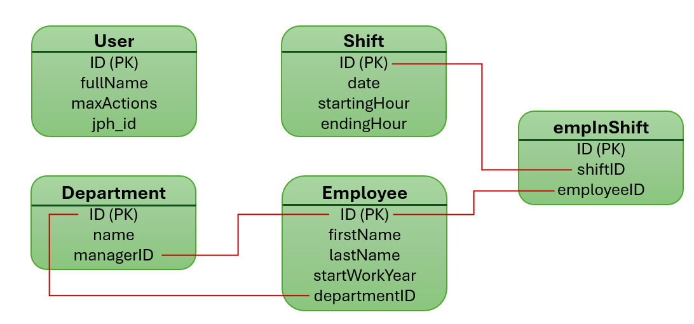

# Factory Employee Management System

This project implements a Factory Employee Management System using Node.js, Express, MongoDB, and HTML with native JavaScript on the client side.

## Models
The factory has **users**, **employees**, **departments**, **shifts** and **empInShift**. 
- Each employee belongs to a department.
- Each department has manager and employees. 
- Each employee works several shifts.
- Each shift includes one or more employees.
- Each empInShift is composed from employee ID and shift ID. 
- ONLY registered users can log in to the system.

## Pages

### Login Page
- The users are predefined at DB collection and their credentials  

## Features

- **Technology Stack:** Node.js, Express server, MongoDB database, and HTML with native JS.
- **Architecture:** Designed with separation of concerns into Data and Business layers.
- **Functionality:** Supports CRUD operations for employees, departments, and shifts.
- **Authentication:** Implemented using `express-jwt` for secure authentication.
- **Authorization:** Includes a user action limitation mechanism to control access.
